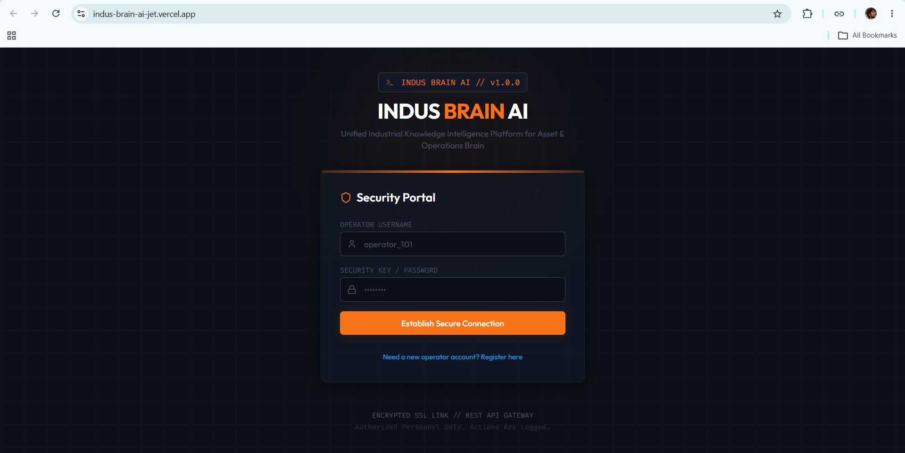
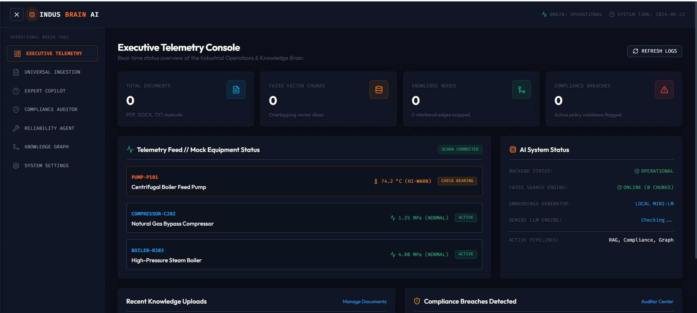

# INDUS BRAIN AI - Unified Industrial Knowledge Intelligence Platform

**Unified Operations and Asset Intelligence Brain // ET AI Hackathon 2026**

**Problem Statement Addressed:** PS8 - AI for Industrial Knowledge Intelligence: Unified Asset & Operations Brain

---

## 🌐 Live Demo
🔗 **[Click here to view the Live Demo of INDUS BRAIN AI](https://indusbrain-ai.vercel.app/)**

---

## 🚀 Overview

**INDUS BRAIN AI** is a production-quality, enterprise-ready knowledge system that ingests fragmented industrial documents—including OEM manuals, SOPs, work permits, safety standards (OISD, Factory Act), and maintenance reports—and transforms them into a unified operations brain.

It helps industrial organizations:
* **Accelerate Repairs:** Empower operators with RAG chat context, cited sources, and similar historical logs.
* **Enforce Compliance:** Automatically audit SOPs against regulatory safety codes and flag violations.
* **Visualize Dependencies:** Render interactive, draggable knowledge topologies showing links between equipment, SOPs, and incidents.

---

## 📸 Application Screenshots

### Upload Documents


### Knowledge Extraction


---
## 🛠️ Technology Stack

### Backend Component
* **Framework:** FastAPI (Python 3.12+)
* **Database:** SQLite (SQLAlchemy ORM)
* **Vector Index:** FAISS (Local storage)
* **Embeddings:** Sentence Transformers (`all-MiniLM-L6-v2`)
* **AI Cognitive Engine:** Gemini 2.5 Flash (via Google GenAI SDK)
* **Auth:** Simple JWT Security

### Frontend Component
* **Framework:** React + Vite + TypeScript
* **Styling:** TailwindCSS
* **Layout:** SCADA-inspired Dark Industrial Cyber-Panel
* **Icons:** Lucide React

---

## 📂 Project Structure

```
indus-brain-ai/
├── backend/            # FastAPI python backend
│   ├── ai/             # Vector indexing and Gemini client wrappers
│   ├── routers/        # Auth, Documents, Copilot, Compliance, Maintenance, Graph
│   ├── config.py       # Configuration settings schema
│   ├── database.py     # SQLite session connection binder
│   ├── models.py       # SQLAlchemy relational schemas
│   ├── schemas.py      # Pydantic validation boundaries
│   ├── auth.py         # Passlib hashing & JWT tokens
│   ├── requirements.txt# Backend dependencies
│   ├── .env.example    # Configuration example
│   └── main.py         # FastAPI main entrypoint
├── frontend/           # React TS Vite frontend
│   ├── src/
│   │   ├── pages/      # Login, Dashboard, Docs, Copilot, Compliance, Maintenance, Graph, Settings
│   │   ├── App.tsx     # Root shell layout & state router
│   │   ├── index.css   # Stylesheets and custom SCADA CSS
│   │   └── main.tsx    # Mount entrypoint
│   ├── tailwind.config.js
│   ├── postcss.config.js
│   └── index.html
├── deployment/         # Production deployment scripts
│   ├── deploy.sh       # AWS EC2 Nginx systemd orchestrator
│   ├── start.sh        # Uvicorn & Nginx start wrapper
│   ├── stop.sh         # Shutdown wrapper
│   └── restart.sh      # Reload wrapper
├── docs/               # Hackathon deliverables
│   ├── architecture_diagram.md  # System layouts (Mermaid)
│   ├── presentation_deck.md     # 10-slide pitch outline
│   ├── demo_script.md           # Walkthrough scripts
│   └── detailed_report.md       # 8-page design document
└── README.md           # Root repository guide
```

---

## 💻 Local Setup & Execution Guide

### Prerequisite Environment
* Node.js v18+ and NPM v10+
* Python 3.10+ and Pip

### 1. Launch FastAPI Backend
1. Open a terminal and navigate to the backend directory:
   ```bash
   cd backend
   ```
2. Create and activate a Python virtual environment:
   ```bash
   python -m venv venv
   # On Windows:
   .\venv\Scripts\activate
   # On macOS/Linux:
   source venv/bin/activate
   ```
3. Install all dependencies:
   ```bash
   pip install -r requirements.txt
   ```
4. Configure your `.env` variables:
   ```bash
   cp .env.example .env
   ```
   Open the new `.env` file and insert your `GEMINI_API_KEY` (obtained from Google AI Studio). If left blank, the app will run in **Demonstration Mode** using dynamic local mock fallbacks.
5. Start the FastAPI development server:
   ```bash
   python main.py
   ```
   The backend API will boot up on `http://localhost:8000`. The interactive Swagger docs will be queryable at `http://localhost:8000/docs`.

### 2. Launch React Frontend
1. Open a new terminal and navigate to the frontend directory:
   ```bash
   cd frontend
   ```
2. Install client packages:
   ```bash
   npm install
   ```
3. Start the Vite development hot reload server:
   ```bash
   npm run dev
   ```
   Open `http://localhost:5173` in your browser.

---

## 🧪 Demonstration & Mock Seeding

To quickly verify and showcase the system's capabilities without having to upload files manually:
1. Log in to the application using any sample operator credentials (e.g. username `operator_101`, password `password`).
2. Go to the **System Settings** page tab.
3. Click the **Seed Demo Data** button. This automatically loads:
   * 10 industrial nodes (PUMP-P101, COMPRESSOR-C202, LOTO Procedures, Safety standards).
   * 9 relational connections mapped out in the SQLite database.
4. Open the **Knowledge Graph** tab to interact with the newly populated, draggable visual network.
5. Go to the **Expert Copilot** and click the suggested questions to test the RAG answer flow.

---

## ☁️ Production Deployment (AWS EC2)

The production deployment runs the FastAPI app under a Systemd daemon and uses Nginx as a reverse proxy to serve frontend static assets.
1. Connect to your EC2 Ubuntu instance.
2. Clone this repository under `/var/www/`.
3. Open the `deployment` directory:
   ```bash
   cd deployment
   ```
4. Set execution permissions and run the deployment script:
   ```bash
   chmod +x deploy.sh
   sudo ./deploy.sh
   ```
   The script installs Nginx, compiles the React site, sets up the Python virtual environment, registers the `indus-backend.service` daemon, and opens port 80/443.

---

## 🏆 Hackathon Deliverables

All documentation deliverables are located inside the `/docs` folder:
* 📊 [System Architecture Diagram (Mermaid)](file:///c:/INDUS%20BRAIN%20AI/docs/architecture_diagram.md)
* 📑 [Detailed Project Report](file:///c:/INDUS%20BRAIN%20AI/docs/detailed_report.md)
* 🎤 [Pitch Presentation Deck Content](file:///c:/INDUS%20BRAIN%20AI/docs/presentation_deck.md)
* 🎬 [Walkthrough Demo Script](file:///c:/INDUS%20BRAIN%20AI/docs/demo_script.md)
