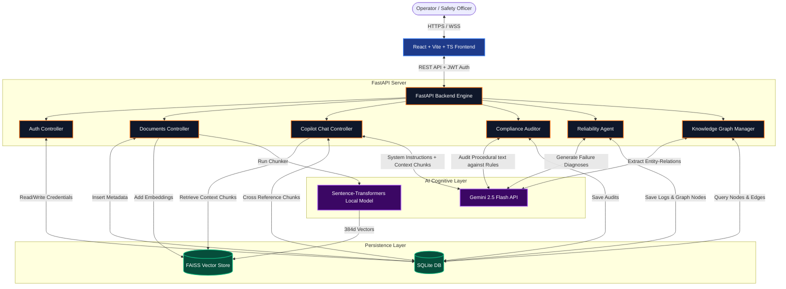
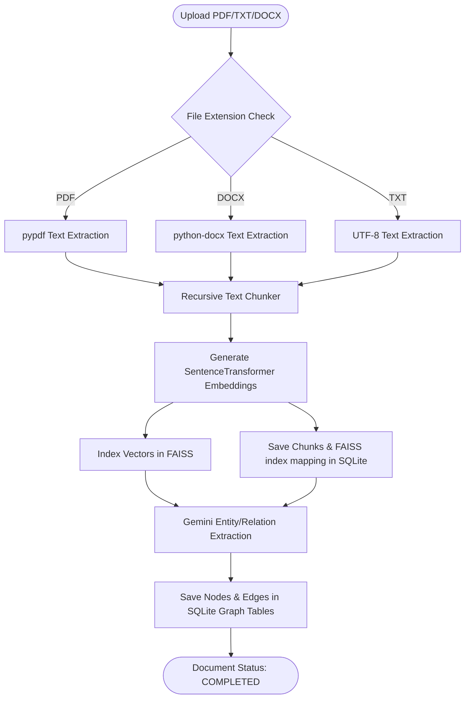

# INDUS BRAIN AI - Architecture Diagram

This document contains visual diagrams mapping out the core flows of the **INDUS BRAIN AI** system.

## 1. System Topology Overview (Decoupled Monolith)

This diagram shows how the frontend, backend, databases, and AI pipelines interact.



---

## 2. Universal Document Ingestion Pipeline

This flowchart outlines the ingestion flow from raw files to SQLite and FAISS indexes.



---

## 3. Conversational RAG Query Loop (Copilot Chat)

This diagram details the retrieval-augmented generation pipeline executed for user queries.

```mermaid
sequenceDiagram
    autonumber
    actor User as Operator / Engineer
    participant FE as Frontend Dashboard
    participant BE as FastAPI Copilot
    participant FAISS as FAISS Vector Store
    participant SQLite as SQLite Database
    participant Gemini as Gemini 2.5 Flash
    
    User->>FE: Ask question ("How should Pump P101 be started?")
    FE->>BE: POST /api/v1/copilot/chat { question }
    BE->>BE: Generate search query embedding
    BE->>FAISS: Perform cosine similarity search (k=5)
    FAISS-->>BE: Return matching Vector Index IDs
    BE->>SQLite: Query chunk text and document titles using Index IDs
    SQLite-->>BE: Return raw chunks, section offsets, and filenames
    BE->>BE: Assemble RAG prompt template (Question + Context Chunks)
    BE->>Gemini: Request structured JSON response (System Prompt + History)
    Note over Gemini: Evaluate question against context;<br/>Determine confidence & cited chunks
    Gemini-->>BE: Return structured JSON { answer, confidence, cited_chunk_indexes }
    BE->>BE: Format citations (link indexes to document names)
    BE-->>FE: Return ChatResponse { answer, citations, confidence_score }
    FE->>User: Render chatbot text, confidence meter, and clickable source citations
```
